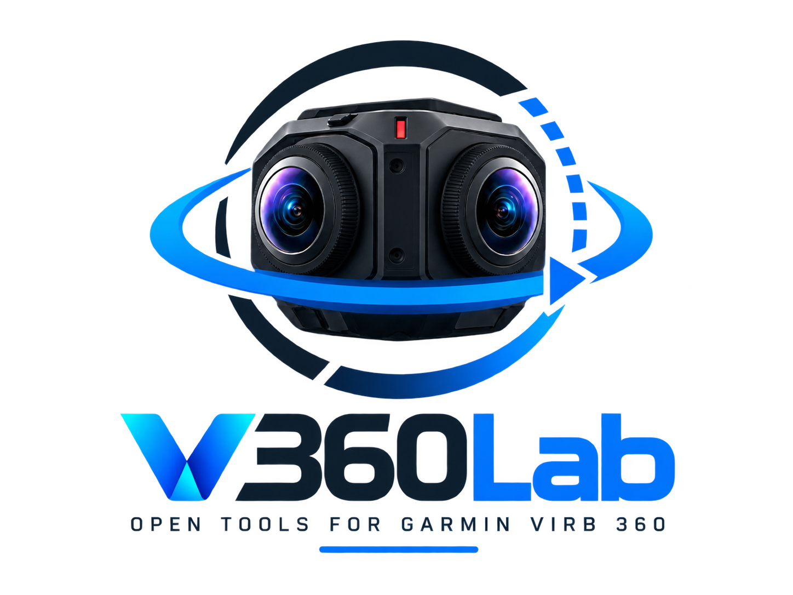

# V360Lab

[](https://github.com/napo/V360Lab/actions/workflows/ci.yml)
[](https://github.com/napo/V360Lab/releases/latest)
[](https://napo.github.io/V360Lab/)



Open-source toolkit for Garmin VIRB 360 video, telemetry and computer vision.

**Download:** Android (signed APK), Windows and Linux builds are on the [releases page](https://github.com/napo/V360Lab/releases/latest). The project website is [napo.github.io/V360Lab](https://napo.github.io/V360Lab/).

> V360Lab is an independent open-source project and is not affiliated with, sponsored by, or endorsed by Garmin. Garmin and VIRB are trademarks of Garmin Ltd. or its subsidiaries.

## Purpose

The Garmin VIRB 360 records spherical video together with rich sensor telemetry (GNSS, speed, altitude, IMU) stored as FIT files. The camera is discontinued, and its official software depends on desktop apps and services that are no longer maintained.

V360Lab is a desktop toolkit that:

- talks to the camera **directly over the local network**, using the VIRB HTTP API, with no Garmin cloud service involved;
- downloads media and the associated FIT telemetry into a predictable folder structure;
- prepares the data for later geospatial and computer-vision processing (see the [roadmap](#roadmap)).

## Current MVP capabilities

- **Find and connect** with one button: V360Lab tries the last address used, then `192.168.0.1` (the camera's own Wi-Fi), then scans the local network. Firmware 4.20 does not announce itself via mDNS/Bonjour or SSDP. The scan checks port 80 on the /24 network and sends `deviceInfo` only to devices that answer; on a home network the camera is found in about 2–3 s. Manual entry of an IP address or host name remains available, and the last address that worked is remembered.
- Step-by-step feedback for slow operations (search, connection, media list, deletion, settings): an animated indicator, elapsed time, and messages that appear as each step happens, with progress bars where useful
- Read camera information: model, firmware, device ID, part number
- Read camera status: recording state, mode, battery, storage, GPS position, connected accessories (headset, Bluetooth and ANT+ sensors); refreshed in the background
- Capture controls on the dashboard:
  - switch between video and photo mode;
  - choose the lens format (360°, front lens, rear lens, RAW);
  - video: mode (normal, slow motion, time-lapse) and loop recording;
  - photo: single, burst or interval (time-lapse) capture with interval and type, plus self-timer;
  - start/stop recording, take a photo, start/stop interval capture. Controls that conflict with the current camera state are disabled.
- Camera settings editor: every choice or on/off feature reported by the camera can be changed, with readable labels. A raw JSON view is available.
- Live preview from the camera (RTSP/H.264 decoded with WebCodecs). With the 360° lens it is shown as an interactive 360° view: drag to look around, pinch or scroll to zoom. While the image waits for a keyframe the app asks the camera for one (`enableIDR`).
- Media library: file name, type, date/time, duration, size, lens mode, thumbnail, preview URLs, FIT availability, favourites (star, `setFavorite`, verified against the media list)
- Play videos and open photos from the library, streamed from the camera through the backend (`virb://` protocol with Range support, so videos can be seeked). Videos start from the camera's low-resolution copy (`.GLV`), with the original one tap away; 360° videos and photos open in the interactive 360° view.
- Telemetry under the video: the FIT file is decoded (`gps_metadata`, `record`, `camera_event`, `timestamp_correlation`), aligned with the video (on the camera's "video start" event when present, otherwise on the media date) and shown as a GPS track, speed and altitude charts and summary figures. The marker follows playback; tapping the track or the chart seeks the video. GPS jumps (positions implying an impossible speed) are dropped. The track can be exported as GPX or GeoJSON (with each point's UTC time and position in the video).
- Georeferenced frames: extract frames of a video every N metres travelled or every N seconds. Each frame is a JPEG with EXIF GPS (position, altitude, UTC time, speed, direction of travel); 360° frames are 2:1 equirectangular with XMP GPano panorama tags, ready for Mapillary, Panoramax or photogrammetry. A `frames.geojson` index lists them. 360° frames can be levelled (experimental, see below).
- Object detection on the extracted frames with a YOLO model (ONNX), run on the device by [tract](https://github.com/sonos/tract), a pure-Rust inference engine. 360° frames are split into eight 90° perspective views; each object is mapped back to its direction (yaw and pitch from the camera's front) and, with the direction of travel, to a compass bearing. Results go to `detections.geojson`, one point per object at the position of its frame. See [Object detection models](#object-detection-models).
- Horizon levelling (experimental): the FIT accelerometer (`accelerometer_data` with `three_d_sensor_calibration`) gives the camera's tilt over time; the 360° video view and the extracted 360° frames can be rotated so that the horizon is straight. The telemetry panel shows the estimated roll and pitch, now and as a chart over the video. Frames are decoded by the webview from the camera's video, so the original 5.7K file needs a device able to decode it; the preview copy always works but is low resolution.
- Download media, FIT telemetry and thumbnails, plus a `metadata.json` holding the original camera metadata. Items can be downloaded one by one or as a selection.
- Delete files on the camera, one by one or as a selection, after a native confirmation dialog. Each deletion is verified against the media list.
- Camera Wi-Fi (Advanced → Wi-Fi): show the camera's own network, the networks it has saved and the ones it can see; save a new network (WPA2, WPA, WEP or open), remove one, or make the camera join a saved network. After switching, this device must join the same network and search for the camera again. **Not yet tested on a real camera** (see the API notes).
- Find the camera (Advanced → Device): it beeps and blinks until you stop it (`locate` / `found`). Standby from the same panel.
- Sensors paired with the camera (`sensors`) and media folders on the card (`mediaDirList`) under Advanced → Device.
- On phones, the 360° view can follow the phone's movement (gyroscope).
- The commands the firmware supports (`commandList`) are shown under Advanced → Device; features the camera does not list are hidden.
- Updates: at start-up the app checks GitHub for a newer release and, after the user confirms, installs it. On Windows and Linux (AppImage) the update is signed with the project's updater key, verified, installed, and the app restarts; on Android the APK is downloaded and Android asks to install it; other installations (.deb, .rpm) open the download page. Releases before 0.5.2 cannot update themselves: install 0.5.2 by hand once.
- Mock camera mode for development without hardware
- Error messages written for the user, with technical details available in debug mode
- User interface in English and Italian (follows the system language by default; switchable from the sidebar or Settings)

## Object detection models

V360Lab does not ship a model inside the app. Under Advanced → App → Object detection (or in the media viewer when no model is set), the app offers to download the recommended one, YOLO11n with 80 COCO classes (10.7 MB), from this repository's `models-v1` release: it checks the size and the free space first, asks for confirmation (reminding to use a Wi-Fi with internet, not the camera's), verifies the SHA-256 and selects the model. A custom model can be chosen as a file instead. Any Ultralytics YOLOv8/YOLO11 *detect* model exported to ONNX works; the class names are read from the file. To export the small general-purpose model (80 COCO classes: people, bicycles, cars, buses, trucks, traffic lights, stop signs, benches, dogs…):

```bash
pip install ultralytics
yolo export model=yolo11n.pt format=onnx opset=13 imgsz=640
```

Ultralytics models are licensed under the AGPL-3.0, like V360Lab. Models trained on other data (road signs, road damage, street furniture) can be used the same way; check the licence of their training data.

Detection speed depends a lot on the device: "Test the speed" in the object detection panel measures it (about 1 s per view, so ~10 s per 360° frame of eight views, on a laptop CPU in a development build; release builds are faster, phones slower). During detection the app shows the time left.

## Architecture

```
React UI (TypeScript)
   │  invoke() / events              src/services/*
   ▼
Tauri commands                        src-tauri/src/commands.rs
   │
   ▼
CameraClient trait                    src-tauri/src/camera/
   ├── GarminVirb360Client            src-tauri/src/virb/client.rs
   │      │  HTTP (reqwest, async)
   │      ▼
   │   Garmin VIRB 360 HTTP API       POST http://<camera>/virb
   └── MockVirb360Client              src-tauri/src/virb/mock.rs
```

The UI never talks to the camera directly. Every request, including thumbnails, goes through Rust. This avoids CORS and webview network restrictions and keeps device communication out of the UI.

### Backend (`src-tauri/src`)

| Module | Responsibility |
|---|---|
| `camera/` | Camera-agnostic `CameraClient` trait, domain models (`DeviceInfo`, `CameraStatus`, `FeatureList`, `MediaItem`), typed `CameraError`, address validation |
| `virb/commands.rs` | VIRB API command names and payloads |
| `virb/models.rs` | Tolerant parsing of VIRB JSON into domain models; original JSON is preserved in `raw` |
| `virb/errors.rs` | Maps transport/HTTP/protocol failures to typed errors |
| `virb/client.rs` | `GarminVirb360Client`: timeouts, logging, streamed downloads |
| `virb/mock.rs` | `MockVirb360Client`: realistic simulated camera |
| `downloads/` | Folder layout, file-name sanitization, media/FIT/thumbnail download, `metadata.json` |
| `telemetry/` | FIT header validation; extension point for a future FIT decoder |
| `discovery.rs` | Finding cameras: candidate addresses, then a scan of the local network |
| `activity.rs` | Coded progress steps of slow operations, emitted to the UI as `activity` events |
| `library.rs` | Multi-request media operations (deletion with verification) |
| `settings.rs` | Persisted user settings (JSON in the app config directory) |
| `commands.rs` | Tauri commands exposed to the UI |
| `error.rs` | `AppError`, serialized to the UI as `{ kind, message, detail, params }` |

To support another 360 camera, implement `CameraClient` for it. Commands, downloads and the UI do not change.

### Frontend (`src`)

| Folder | Content |
|---|---|
| `services/` | Typed wrappers around Tauri commands (the only place that calls `invoke`) |
| `context/` | Settings, camera connection and download state (React context, no Redux) |
| `hooks/` | `useCamera`, `useSettings`, `useDownloads`, `useAsyncResource`, `useThumbnail` |
| `pages/` | Connection, Dashboard, Media, Camera Features, Settings, About |
| `components/` | Reusable UI parts, grouped by feature |
| `i18n/` | Translations (`en.ts`, `it.ts`), plural/placeholder handling, language context |
| `types/` | TypeScript mirrors of the Rust models |
| `utils/` | Formatting and error helpers |

The connection is modelled explicitly as `disconnected | connecting | connected | error`. Camera status is polled from the app root, so it keeps updating whichever page is open.

### Internationalization

UI strings live in `src/i18n/`. `en.ts` is the reference dictionary; each other language must provide exactly the same keys, and TypeScript enforces this. Placeholders use `{name}`. Keys ending in `_one` / `_other` are plural forms chosen with `Intl.PluralRules`.

The backend never produces user-facing text in a specific language:

- errors carry a stable `kind` plus `params` (address, command, HTTP status…), translated by the UI as `errors.<kind>`. The English `message` is only a fallback;
- download warnings carry a `code` (`fitFailed`, `thumbnailFailed`, `fitInvalid`) and a technical `detail`.

The chosen language is stored in the settings (`language`: `en`, `it`, or `null` for the system language).

To add a language:

1. Copy `src/i18n/it.ts` to `src/i18n/<code>.ts` and translate it.
2. Register it in `DICTIONARIES`, `LANGUAGES` and `isLanguage` in `src/i18n/translate.ts`, and in the `Language` type.
3. Add the code to `SUPPORTED_LANGUAGES` in `src-tauri/src/settings.rs`.

The test in `src/i18n/translate.test.ts` checks that every language has the same keys and placeholders as English.

### Downloaded file layout

```
<download directory>/            default: ~/Downloads/V360Lab
  2024-07-03/                    capture date (UTC)
    V0010042/                    recording name
      V0010042.MP4               original media file
      2024-07-03-09-46-40.fit    FIT telemetry, when available
      thumbnail.jpg              when available
      metadata.json              original camera metadata + download record
```

`metadata.json` contains `cameraMetadata` (the media entry exactly as the camera returned it), a `normalized` view, the list of downloaded files and any warnings (`{code, detail}`). Files are written as `*.part` and renamed only when complete. A media file that already exists with the expected size is kept and not downloaded again.

## Development setup

Requirements:

- [Node.js](https://nodejs.org/) 20 or later and npm
- [Rust](https://rustup.rs/) 1.82 or later
- Tauri 2 system dependencies for your platform: see <https://v2.tauri.app/start/prerequisites/>
  (on Debian/Ubuntu: `libwebkit2gtk-4.1-dev`, `build-essential`, `libssl-dev`, `libayatana-appindicator3-dev`, `librsvg2-dev`)

Install the JavaScript dependencies (the Tauri CLI is included as a dev dependency):

```bash
npm install
```

## Running in development mode

```bash
npm run tauri dev
```

This starts Vite on `http://localhost:1420` and opens the desktop window with hot reload. Backend logs go to the terminal. Debug builds log every camera request and response at debug level; response bodies are truncated and binary content is never logged. Use `RUST_LOG` to change verbosity, e.g. `RUST_LOG=v360lab_lib=trace`.

**Without a camera:** tick *Use simulated camera* on the connection screen, or enable *Mock mode* in Settings. The mock returns realistic device information, status, features and media entries. Recording, photos and downloads (placeholder files and valid empty FIT files) all work.

Running `npm run dev` alone serves the UI in a normal browser, but without the Rust backend. The app then reports that the backend is unavailable.

### Tests

```bash
# Rust: response parsing, malformed responses, HTTP error handling (mocked
# with wiremock), downloads, settings, mock camera. No hardware needed.
cd src-tauri && cargo test

# Opt-in scan of the local network for a camera (no address needed)
V360LAB_SCAN=1 cargo test --test real_camera scan -- --ignored --nocapture

# Opt-in checks against a real camera (read-only on the camera; downloads
# the smallest video with FIT and the smallest photo into a temp directory)
V360LAB_CAMERA=192.168.0.1 cargo test --test real_camera -- --ignored --nocapture --test-threads=1

# Frontend: formatting, error helpers, translations (keys, placeholders, plurals)
npm test

# Type checking
npm run typecheck
```

## Releases and continuous integration

Everything is built by GitHub Actions (`.github/workflows/`):

| Workflow | Trigger | Output |
|---|---|---|
| `ci.yml` | every push to `main` and every pull request | typecheck, frontend tests, clippy, Rust tests |
| `release.yml` | a pushed tag `v*` (or run manually) | GitHub release with Windows (`.msi`, `-setup.exe`), Linux (`.AppImage`, `.deb`, `.rpm`) and a signed Android APK |
| `pages.yml` | changes in `site/` on `main` | the project website on GitHub Pages |
| `test-build.yml` | run manually from the Actions tab, on any branch | a signed Android APK attached to the run as an artifact (14 days), to try changes on a phone without a release |

To publish a new version, bump `version` in `package.json`, `src-tauri/Cargo.toml` and `src-tauri/tauri.conf.json` (`node scripts/check-version.mjs` verifies they match; the release workflow also checks them against the tag), add a `## x.y.z` section to `CHANGELOG.md` (it becomes the release notes), commit, then:

```bash
git tag v0.5.3 && git push origin v0.5.3
```

### Android signing

The APK is signed with a release key stored in the repository secrets `ANDROID_KEY_BASE64` (base64 of the keystore), `ANDROID_KEY_ALIAS` and `ANDROID_KEY_PASSWORD`. The workflow writes them to `src-tauri/gen/android/keystore.properties`, which is never committed. Without that file, local release builds are unsigned. **Keep a backup of the keystore:** updates to an installed app must be signed with the same key.

The Android project is in `src-tauri/gen/android`. For local Android builds you need the Android SDK and NDK (`ANDROID_HOME`, `NDK_HOME`) and the Rust Android targets; see the [Tauri Android prerequisites](https://v2.tauri.app/start/prerequisites/#android).

## Building

```bash
npm run tauri build
```

Installers and bundles are written to `src-tauri/target/release/bundle/`.

## Camera connection requirements

- Enable Wi-Fi on the VIRB 360 and connect this computer to the camera's network. Alternatively, put both on the same local network.
- When the camera acts as an access point it is typically reachable at `192.168.0.1`. This is only a default; enter the actual address when it differs.
- The address field accepts `192.168.0.1`, `192.168.0.1:8080` or `http://virb.local`. Paths, credentials and non-HTTP schemes are rejected.
- V360Lab contacts only the configured address. URLs reported by the camera (media, thumbnails, FIT) are re-anchored onto that address, redirects are not followed and system proxies are bypassed. No data is sent to external services. Internet is used only for two optional things: checking for a newer release on GitHub at start-up (at most every six hours, can be turned off in Settings → Updates), and downloading the object detection model when the user asks for it (from this repository's `models-v1` release, checked against a fixed size and SHA-256).

### Timeouts

| Operation | Timeout |
|---|---|
| TCP connect | 3 s |
| API command / thumbnail | 10 s total |
| `mediaList` | 60 s total |
| Wi-Fi network scan | 30 s total |
| Download | 30 s without data (no total limit, since videos can be several GB) |

## VIRB API notes

Checked against a VIRB 360 running **firmware 4.20**. Sanitized real responses are in `src-tauri/tests/fixtures/real_fw420/`.

Confirmed:

- Commands are `POST /virb` with body `{"command": "<name>"}`. Responses are JSON objects with `"result": 1` on success.
- `deviceInfo` returns `{"deviceInfo": [{model, firmware, type, partNumber, deviceId, macAddress}]}`. `firmware` is an integer scaled by 100 (`420` = 4.20) and `deviceId` is a number.
- `status` returns flat fields: `state` (`"recording"` while recording, `"idle"` otherwise), `recordingTime` (s), `recordingTimeRemaining` (s), `batteryLevel` (percent, float), `batteryChargingState` (a number), `totalSpace` / `availableSpace` **in KiB** (converted to bytes), `gpsLatitude` / `gpsLongitude`, `wifiSignalStrength`, `photoCount`, and others. There is **no `mode` field**. The shooting mode appears in `features` as `shootingMode`.
- `features` returns `{"features": [{type, feature, enabled, value, options}]}`. `type` 0 = action (no value), 1 = choice, 2 = on/off toggle (`"1"`/`"0"`).
- `mediaList` returns `{"media": [{type, subtype, name, url, thumbUrl, lowResVideoPath, fitURL, fileSize, date, groupId, index, lensMode, fav}]}`. `date` is Unix seconds in UTC (checked against the photo's EXIF capture time). URLs include the camera IP and `:80`. Video thumbnails are `.THM` (JPEG). Photo thumbnails are `.BMP` under `/thumb/`. `lensMode` values include `360` and `frontLensOnly`. Photos have no `fitURL`.
- Downloads work end to end: MP4, FIT (valid FIT file), JPEG video thumbnails, 160×120 BMP photo thumbnails and JPG photos with EXIF/GPS. Sizes match `fileSize`.
- `updateFeature` (`{"command":"updateFeature","feature":"<key>","value":"<value>"}`) returns the complete, updated feature list. V360Lab checks that the camera reports the requested value afterwards.
- `deleteFile` takes a **`files` array** of URLs as listed by `mediaList`: `{"command":"deleteFile","files":["http://…/DCIM/102_VIRB/V0151058.MP4"]}`. With a single `file` string, or any other parameter name, the camera answers `"result": 1` **but deletes nothing**. V360Lab therefore deletes a whole selection in one request and then re-reads the media list to confirm each deletion.
- Deleting a video also deletes its `.GLV` preview and `.THM` thumbnail, but **not its FIT file** in `GMetrix/`. FIT files cannot be deleted over Wi-Fi: `deleteFile` answers `"result": 0` for them, whatever the path form.
- `stopStillRecording` exists and returns `"result": 1` when idle.
- `mediaDirList` returns the media directories (`2:/DCIM/100_VIRB`, …). V360Lab does not use it yet.
- An unknown command gets **HTTP 400** with an nginx HTML page; this is reported as "unsupported command".
- `stopRecording` returns `{"result": 1, "media": {"uuids": ["<...>.fit"]}}`.
- `mediaList` is slow on a full card (about 4 s and 280 KB for ~1000 files), so it gets a 60 s timeout.

Still assumed (not yet observed):

- Wi-Fi management (`{"command":"networks","subCommand":…}`) follows Garmin's VIRB app, recovered from its native library ([docs/virb-http-api.md](docs/virb-http-api.md)): `getApSSID`, `getConfiguredNetworks`, `getScannedNetworks`, `configureNetwork` (`args`: `type: "station"`, `securityType` `WPA2`/`WPA`/`WEP`/`Open`, `ssid`, `password`), `connectNetwork` and `removeNetwork` (`args.ssid`). The app reads lists from `subCommand.networks[]` (`ssid`, `securityType`); V360Lab also accepts them at the top level. No response has been observed on firmware 4.20 yet: `cargo test --test real_camera reads_wifi_networks -- --ignored --nocapture` prints them.

- How the camera reports status during a photo interval capture, and whether `snapPicture` / `stopStillRecording` start and stop it. V360Lab assumes they do.
- Whether the photo lens format has its own feature (`photo360Format`) or reuses `video360Format`. The UI uses whichever exists.
- How FIT file names (e.g. `2021-02-19-18-21-42.fit`) relate to the media `date`.

Parsing is deliberately tolerant. Every field is optional, numbers may arrive as strings, several field-name aliases are accepted, and unknown properties are kept in `raw` so that firmware differences can be inspected in debug mode.

## Known limitations

- Tested with one VIRB 360 (firmware 4.20), including small media and FIT downloads; multi-GB downloads have not been tried yet.
- Settings whose value is free text (`friendlyName`, `wifiTimeout`) and actions (`locateCamera`, `previewWhileRecording`) cannot be changed from the settings editor. The camera can be made to beep from Advanced → Device instead.
- Settings are locked while recording.
- FIT files of deleted videos remain on the camera (`GMetrix/`). Firmware 4.20 refuses to delete them over Wi-Fi; remove them from the SD card or USB storage.
- On firmware 4.20 the dashboard mode comes from the `shootingMode` feature. It is read after connecting and on manual refresh, not on every status poll.
- FIT decoding covers the GPS track, camera events and the accelerometer; gyroscope and magnetometer are not decoded yet. Horizon levelling uses only the accelerometer averaged over one second, so fast movements (e.g. on a bike) can leave some wobble. The track is drawn without a background map, so that no data leaves the device.
- Video playback depends on the system's codecs: on Linux, H.264 needs the GStreamer `gst-libav` plugin. The original 360° files (up to 5.7K) may be too heavy for phones; the low-resolution copy is the default.
- The capture date folder uses UTC.
- Only one camera can be connected at a time.
- On Android, downloads are saved in the app's private storage for now (not in the public Downloads folder).
- Windows installers are not code-signed yet (SmartScreen may warn).

### Still to verify with a real camera

1. Downloading a multi-GB video (the `real_camera` test covers the smallest files).
2. Photo interval capture end to end (start, status while running, stop) and switching between video and photo mode.
3. How raw (unstitched) dual-lens recordings and time-lapse groups (`groupId`) appear in the media list.
4. Whether `snapPicture` is accepted while recording or in video mode (the UI currently disables it while recording).
5. The features added in 0.3.0 and later, written from Garmin's app but not yet run against the camera: Wi-Fi management, `commandList`, `locate`/`found`, `enableIDR`, `sensors`, `standby`, `mediaDirList`, `setFavorite`, the orientation of the 360° view, playback of `.GLV` files, and the FIT decoding of real VIRB files.

6. Horizon levelling: which accelerometer axis points out of the front lens is a guess (`FORWARD_AXIS_GUESS` in `src/utils/level.ts`); the vertical axis is detected from the data. To confirm it, record a short video holding the camera still: 5 s upright, 5 s tilted about 30° to the right, 5 s tilted about 30° forward (front lens down). In the telemetry panel the tilt should read about 0°, then roll +30°, then pitch +30°. If roll and pitch are swapped or have the wrong sign, the guess needs changing. The `decodes_real_fit_telemetry` hardware test also prints the accelerometer readings.

Please report findings (with the raw JSON from debug mode) in an issue.

## Roadmap

**Phase 1: camera toolkit (done)**
- VIRB connection
- Status
- Camera controls
- Media browser
- Media/FIT download

**Phase 2: telemetry (started)**
- FIT parsing: GPS track, camera events and accelerometer done (native parser, `src-tauri/src/telemetry/decode.rs`); gyroscope and magnetometer still to do
- Timeline: speed and altitude synchronized with the video, done
- GPS track: done (drawn offline, no background map yet)
- Synchronized video + map: done for the track; a background map is still to do

**Phase 3: computer vision (started)**
- Frame extraction: done, georeferenced (EXIF GPS, GPano for 360°), every N metres or seconds
- YOLO detection: started (any YOLOv8/YOLO11 ONNX model, on the device, with directions and bearings)
- OpenCV processing
- Object detection
- YOLO
- SAM segmentation

**Phase 4: geospatial outputs**
- Georeferenced detections
- GeoJSON / GeoParquet export
- MapLibre visualization

**Phase 5: 3D**
- Depth estimation
- Photogrammetry
- SfM
- Point clouds
- Experimental 3D reconstruction

## License

Copyright © 2026 Maurizio Napolitano.

V360Lab is free software, licensed under the [GNU Affero General Public License v3.0](LICENSE) (AGPL-3.0). The complete source code is at <https://github.com/napo/V360Lab>; the app shows this address under Advanced → About, and the website links to it.

## Disclaimer

V360Lab is an independent open-source project and is not affiliated with, sponsored by, or endorsed by Garmin. Garmin and VIRB are trademarks of Garmin Ltd. or its subsidiaries.
